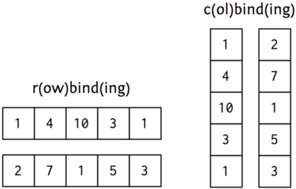

# R and Data Science

## R

R est un langage versatile pour la manipulation et le traitement des données [@ihaka-1996-r]. C'est un logiciel open-source dérivé du langage S [@becker-1984-s], offrant à la fois un langage de programmation et des routines d'analyse statistiques puissantes. 

De nombreux packages, disponibles sur le site [CRAN][cran], fournissent des extensions aux fonctionnalités de base de R.

<http://r-project.org>

[cran]: http://cran.r-project.org

## RStudio

<http://rstudio.com>

{ width=100% }


## Data Science

{ width=50% }

<http://drewconway.com/zia/2013/3/26/the-data-science-venn-diagram>


## Ressources internet

1. Matloff (2011). [The Art of R Programming](http://heather.cs.ucdavis.edu/~matloff/132/NSPpart.pdf). No Starch Press. 
2. Wickham & Grolemund (2015). [R for Data Science](http://adv-r.had.co.nz). [R4DS]
3. Hastie et al. (2009). [The Elements of Statistical Learning](http://statweb.stanford.edu/~tibs/ElemStatLearn/). Springer. 
4. James et al. (2015). [An Introduction to Statistical Learning](http://www-bcf.usc.edu/~gareth/ISL/getbook.html). Springer. [ISLR]
5. Leskovec et al. (2011). [Mining of Massive Datasets](http://www.mmds.org). Cambridge University Press. 


# Les bases du langage R

## R comme calculateur

**R**ead **E**val **P**rint **L**oop

```r
> r <- 5
> 2 * pi * r^2
[1] 157.0796
```

Variable, constantes, opérateur, affectation, passage par valeur/référence...


## Aide en ligne

    > ?pi  ## help(pi)
    Constants                 package:base                 R Documentation
    
    Built-in Constants
    
    Description:
    
         Constants built into R.
    
    Usage:
    
         LETTERS
         letters
         month.abb
         month.name
         pi


## Packages

Packages de base : `stats`, `lattice`, `MASS`, ...

```r
library(MASS)
help(package = MASS)
data(package = MASS)
MASS::lm.ridge  # espace de nom
if (!require(dplyr))
  install.packages("dplyr", dependencies = TRUE)
```

[CRAN](http://cran.r-project.org) : liste des packages, Task Views, documentation.


## Script R

Plutôt que de saisir toutes les commandes dans la console, il est souvent plus judicieux d'enregistrer ses commandes dans un script R : simple fichier texte avec extension `.r` ou `.R`.

- construire une suite d'instructions réutilisables, modifiables et partageables
- fonctionnalités avancées pour l'interaction avec les scripts R dans RStudio


## Espace de travail

On distingue le répertoire courant de travail et l'espace de travail ou environnement.

```r
getwd()
setwd("~/Documents")
dir(pattern = ".R")
source("./monfichier.R")
ls()
```

RStudio fournit également des outils facilitant la gestion de l'espace de travail et la navigation dans le système de fichiers.


## Les objets R

L'élément de base est le vecteur que l'on peut créer avec la commande `c()`, entre autres, et dont les éléments sont de type :

- `numeric`, des nombres (entiers ou flottants)
- `logical`, des booléens à valeur dans {`TRUE`, `FALSE`}
- `character`, des caractères ASCII

## Variables et affectation

Les expressions suivantes sont valides :

```r
nombre <- 3.141593
v <- c(1,2,3,4)
b <- c(T,F,T,F)
s <- c("h","e","l","l","o")
a <- b <- rnorm(2)
b -> u
```


## Adresser les éléments d'un vecteur

On utilise `[` pour indexer les n éléments d'un vecteur, sachant que l'index du premier élément vaut 1 (et non 0 comme dans certains langages) :

```r
v[1]
v[c(1,4)]
v[1:4]
```

## Adresser les éléments d'un vecteur (con't)

On peut adresser les élements d'un vecteur en utilisant les valeurs contenues dans un autre vecteur (principe d'un dictionnaire ou table de hachage), par exemple :

```r
v <- c(1,2,3,4)
b <- c(T,F,T,F)
s <- c("h","e","l","l","o")
v[b]    # valeurs de v telles que b vaut TRUE
s[v[2]] # v[2]=2, d'où s[2] qui vaut "e"
```

## Illustration

```r
x <- c(1,4,10,3,1)
names(x) <- letters[1:length(x)]
idx <- c(1,3,4)
g <- c(T,F,T,T,F)
```

## Illustration

{ width=50% }

Sélection indexée des éléments de `x` :

```r
x[idx]
x[g]
```

## Trier, classer

On peut également effectuer des opérations de tri sur un vecteur :

```r
x <- 1:10
xs <- sample(x)
sort(xs, decreasing = TRUE)
order(xs)
```

ou obtenir le rang de ses élements

```r
rank(rev(xs))
```

## Nombres aléatoires

Dès que l'on manipule des nombres aléatoires, il est nécessaire de fixer la graine du générateur congruentiel, autrement on ne pourra pas reproduire la séquence (e.g., cas des simulations). 

```r
> runif(4)
[1] 0.1791854 0.7889672 0.8164497 0.2004527
> runif(4)
[1] 0.80375195 0.01630027 0.45203035 0.58823877
```

    % Rscript -e "print(runif(4))"
    [1] 0.44252118 0.61164540 0.24009883 0.01861185
    % Rscript -e "print(runif(4))"
    [1] 0.04160656 0.42925736 0.89571922 0.62046257
    % Rscript -e "set.seed(101); print(runif(4))"
    [1] 0.37219838 0.04382482 0.70968402 0.65769040


# Objets spécifiques R

## Codage des données manquantes

Le symbole `NA` est utilisé pour désigner une donnée manquante (différent d'une valeur non représentable en machine telle que `-Inf`).

```r
x <- 1:10
x[5] <- NA
is.na(x)
sum(is.na(x))
```

## Représentation des données catégorielles

R utilise le terme "factor" pour représenter une variable catégorielle possédant plusieurs modalités (ou niveaux) mutuellement exclusives. 

Hors cas des variables binaires (0/1), l'utilisation de facteur est recommandée car de nombreuses fonctions de R ont un comportement spécifique en présence de facteurs. 

Ceux-ci sont également utiles dans les notations par formules, les graphiques, les procédures d'aggrégation ou de fusion de données, et de nombreux modèles statistiques.


## Génération d'un facteur

```r
> state <- sample(c("on", "off"), 20, rep = TRUE)
> class(state)
[1] "character"
> head(state)
[1] "off" "off" "on"  "off" "on"  "off"
> state <- factor(state)
> class(state)
[1] "factor"
> head(state)
[1] off off on  off on  off
Levels: off on
> levels(state)
[1] "off" "on"
> nlevels(state)
[1] 2
```

## Propriétés des facteurs

Un facteur R possède des niveaux (`levels=`) et des étiquettes (`labels=`) associées à chacun de ces niveaux. Le premier niveau est appelé niveau de référence.

```r
> evt <- c(0,1)
> y <- sample(evt, 10, rep = TRUE)
> y
 [1] 1 1 1 0 1 1 0 0 1 0
> factor(y, levels = 0:1, labels = c("non", "oui"))
 [1] oui oui oui non oui oui non non oui non
Levels: non oui
```

## Manipulation de chaînes de caractères

La plupart des opérations habituelles sur les chaînes de caractères sont possibles sous R :

- recherche de motif par regex
- extraction de sous-chaînes
- découpage selon le motif
- remplacement de sous-chaînes

Pour plus de souplesse : packages [stringr][stringr] et [stringi][stringi].

[stringr]: http://journal.r-project.org/archive/2010-2/RJournal_2010-2_Wickham.pdf
[stringi]: (http://cran.r-project.org/web/packages/stringi/index.html


## Applications

```r
> a <- c("toto-24", "titi-13")
> substr(a, 1, 4)
[1] "toto" "titi"
> strsplit(a, "-")
[[1]]
[1] "toto" "24"

[[2]]
[1] "titi" "13"
> gsub("[1-9]*$", "", a)
[1] "toto-" "titi-"
```

## Manipulation de dates

Attention à la notation anglo-saxonne (ou localisation du système) : mm/dd/yyyy (vs. dd/mm/yyyy en français).

```r
> d1 <- c("22/01/1998", "24/06/1999")
> d2 <- as.POSIXct(d1, format = "%d/%m/%Y")
> d2
[1] "1998-01-22 CET"  "1999-06-24 CEST"
> diff(d2)
Time difference of 517.9583 days
```

Pour plus de souplesse : package [lubridate][lubridate].

[lubridate]: http://vita.had.co.nz/papers/lubridate.html

# Objets structurés

## Matrice

Collection de valeurs de même type (e.g., nombres ou caractères) arrangées dans une structure à deux dimensions (`array`, n-dimensions).

```r
x <- c(1,4,10,3,1)
y <- c(2,7,1,5,3)
cbind(x, y)
rbind(x, y)
```

## Illustration

{ width=50% }

## Liste

Collection de valeurs de différents types, de taille éventuellement variable.

```r
x <- c(1,4,10,3,1)
y <- c("a", "b", "c")
z <- list(alpha = x, beta = y)
```

```r
> str(z)
List of 2
 $ alpha: num [1:5] 1 4 10 3 1
 $ beta : chr [1:3] "a" "b" "c"
```

## Data frame

Collection de valeurs de différents types, de même taille (restriction par rapport aux listes).

```r
x <- c(1,4,10,3,1)
y <- letters[1:5]
z <- data.frame(alpha = x, beta = y)
```

```r
> str(z)
'data.frame':	5 obs. of  2 variables:
 $ alpha: num  1 4 10 3 1
 $ beta : Factor w/ 5 levels "a","b","c","d",..: 1 2 3 4 5
```

## Illustration

{ width=50% }


# Structures de contrôle et programmation R


## Branchement conditionnel (If-else)

```r
test <- TRUE
if (test) print("Hello") else print("Bye-bye")
ifelse(test, "Hello", "Bye-bye")
```

La dernière expression est vectorisée :

```r
n <- 20
x <- sample(letters[1:3], n, rep = TRUE)
y <- sample(1:100, n)
z <- ifelse(x == "a", 1, 0)
```


## Itération (for)

```r
s <- 0
for (i in 1:10) {
	s <- s+i
}
```

En plus simple :

```r
cumsum(1:10)
```

## Commandes *apply

Souvent, on peut exploiter les fonctions de la famille `*apply()` :

```r
val <- c(2, 8, 3, 4)
f <- function(x) x+2
res <- numeric(4)
for (i in 1:4) res[i] <- f(val[i])
```

En plus simple :

```r
sapply(val, f)
```

## Fonctions

Comme dans d'autres langages de programmation, une fonction accepte des arguments.

    f <- function(x, y = NULL, ...) {
      ...
      return(val)
    }

```r
> args(sapply)
function (X, FUN, ..., simplify = TRUE, USE.NAMES = TRUE)
NULL
```

## Application

```r
f <- function(x) mean(x)
v <- sample(1:100, 10)
f(v)
```

Ajout de paramètres avec valeur par défaut :

```r
f <- function(x, na.rm = FALSE) mean(x, na.rm = na.rm)
v[sample(1:length(v), 5)] <- NA
f(v)  ## na.rm = FALSE
f(v, na.rm = TRUE)
```


## References
