##  

> The greatest value of a picture is when it forces us to notice what we never expected to see.  
> ―John Tukey


# Les différents systèmes graphiques

## Systèmes graphiques

R dispose de deux principaux système graphiques, `base` et `grid` [@murrell-2005-r-graph], et de trois interfaces/packages : `graphics` [@becker-1988-new-s-languag], `lattice` [@sarkar-2008-lattic-multiv] et `ggplot2` [@wickham-2009-ggplot] ; voir aussi @chang-2013-r-graph-cookb.

## Graphiques de base

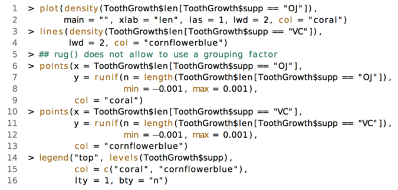

##  

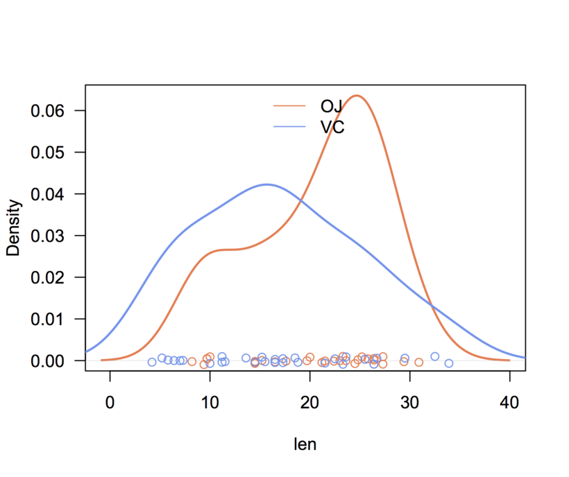

## Graphiques lattice

    library(lattice)
    densityplot(~ len, data = ToothGrowth, group = supp, 
                auto.key = TRUE)

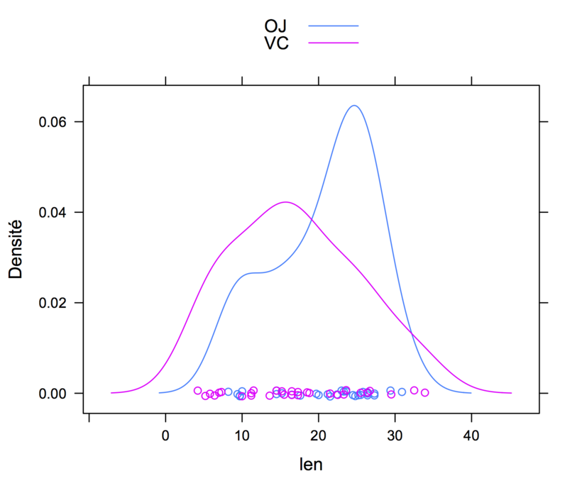


## Graphiques ggplot

    library(ggplot2)
    ggplot(data = ToothGrowth, aes(x = len, color = supp)) +
      geom_line(stat = "density") + geom_rug()

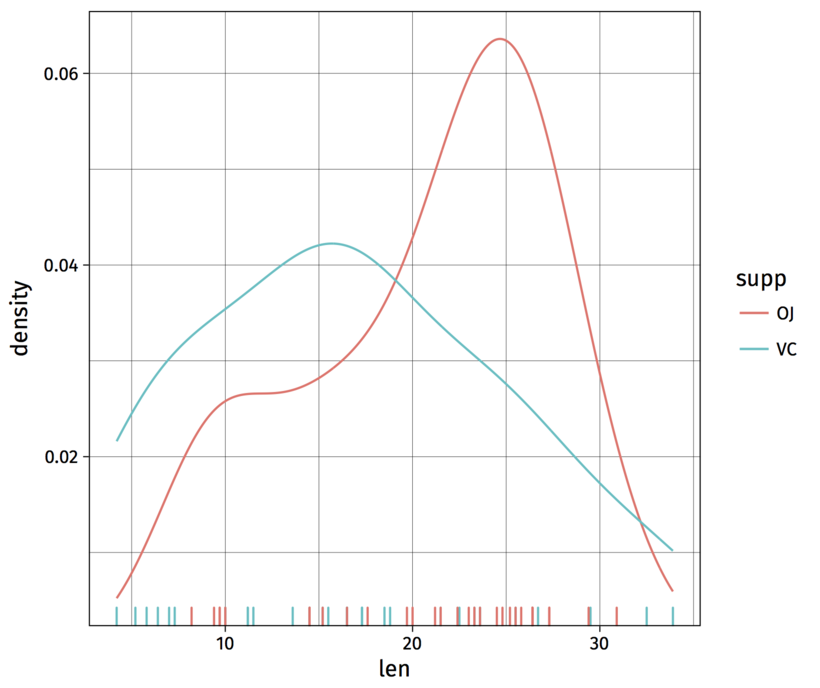

# Le package ggplot2


## "The Grammar of Graphics"

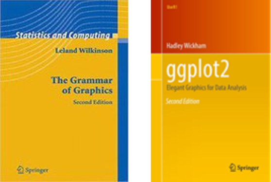

- @wilkinson-2005-gramm-graph fournit un cadre de réflexion et des idées d'application d'une grammaire des graphiques
- @wickham-2009-ggplot offre une implémentation en langage R : <https://github.com/hadley/ggplot2-book>


## Un concept de couches

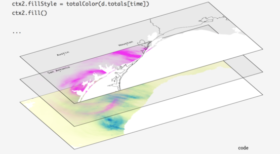

<https://roadtolarissa.com/hurricane/>


## Les bases d'un graphique ggplot

- `ggplot()` : un data frame (`data =`) et un mapping (`aes()`)
- `geom_*()` : un ou plusieurs objets géométriques
- `facet_wrap()` : un système de facettes (conditionnement)
- `scale_*_*()` : une échelle pour les axes ou les palettes de couleurs
- `coord_*()` : un système de coordonnées
- `labs()` : des annotations pour les axes et le graphique
- `theme_*()` : un thème personnalisé

##  


[ggplot2-cheatsheet.pdf](https://www.rstudio.com/wp-content/uploads/2015/03/ggplot2-cheatsheet.pdf)[^1]

[^1]: version plus récente disponible sur le [site de RStudio](https://www.rstudio.com/resources/cheatsheets/).

## Mise en œuvre

```r
p = ggplot() +
    layer(data = MASS::birthwt,
          stat = "identity",
          geom = "point",
          mapping = aes(x = lwt, y = bwt),
          position = "identity") +
    layer(data = MASS::birthwt,
          stat = "smooth",
          geom = "line",
          mapping = aes(x = lwt, y = bwt),
          position = "identity",
          params = list(method = "auto"))
```

##  

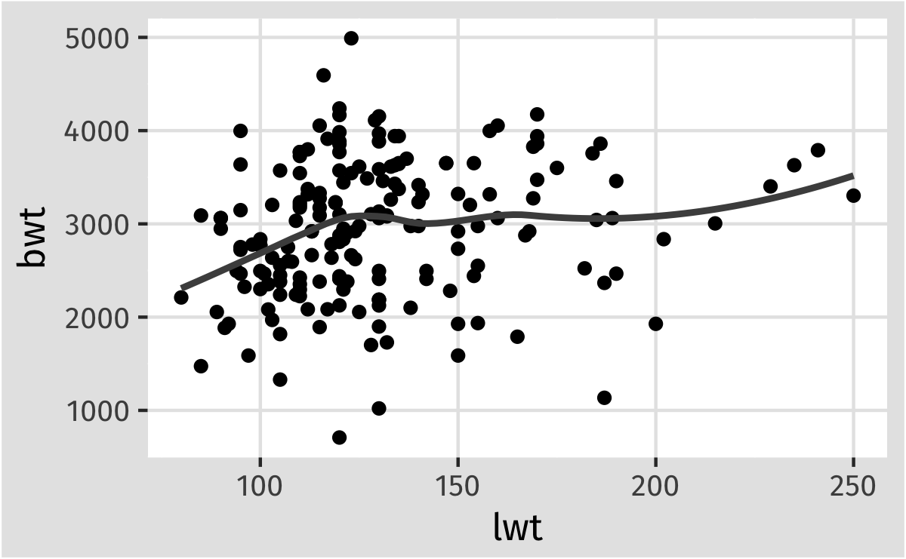

## Syntaxe ggplot

Formulation équivalente et simplifiée :

```r
library(MASS)
p = ggplot(data = birthwt, aes(x = lwt, y = bwt))
p + geom_point() + geom_smooth(method = "auto")
```

→ structure graphique (`ggplot`) et objets géométriques (`geom_*`).

## Histogramme d'effectifs

`MASS::survey` = "responses of 237 Statistics I students at the University of Adelaide to a number of questions." [@venables-2002-moder-applied]

12 variables : `Sex` `Wr.Hnd` `NW.Hnd` `W.Hnd` `Fold` `Pulse` `Clap` `Exer` `Smoke` `Height` `M.I` `Age`

```r
p = ggplot(data = survey, aes(x = Height))
p + geom_histogram(binwidth = 5)  ## bins = 11
```

##  

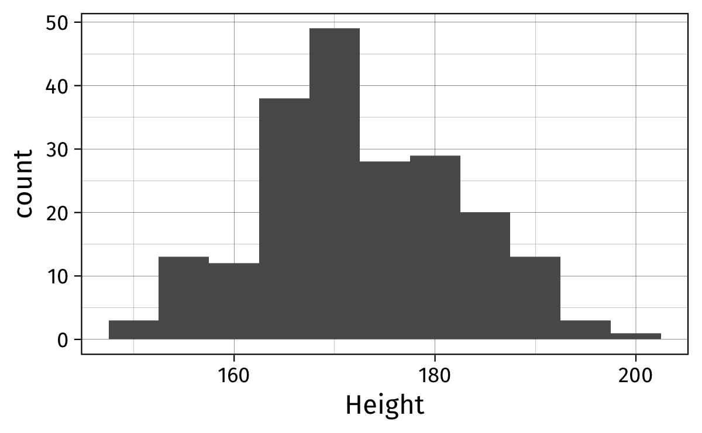

## Courbe de densité

```r
p = ggplot(data = survey, aes(x = Height))
p + geom_density(adjust = 0.8)        ## (1)
```

On peut également construire une courbe de densité explicitement à l'aide de `geom_line()`

```r
p + geom_line(stat = "density", ...)  ## (1)
```

##  

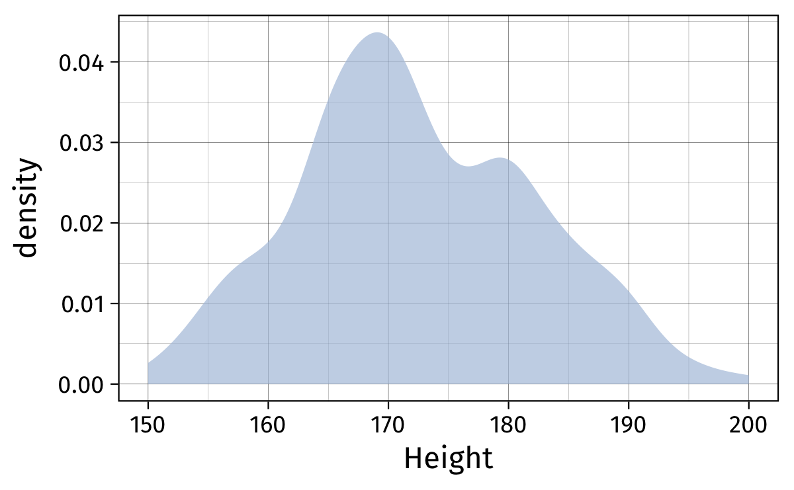


## Estimateur

@venables-2002-moder-applied, *§5.6 – Density Estimation* (pp. 126–130)

$$ \hat f(x) = \frac{1}{nb}\sum_{j=1}^n K\left(\frac{x-x_j}{b}\right) $$

$x_1,\dots,x_n$ un échantillon de taille $n$  
$K()$ une fonction noyau fixée, par défaut gaussienne  
$\hat b = 1.06\:\textrm{min}(\hat\sigma, \textrm{IQR}/1.34)\: n^{-1/5}$ la largeur de la fenêtre de lissage.


## Histogramme d'effectifs revisité

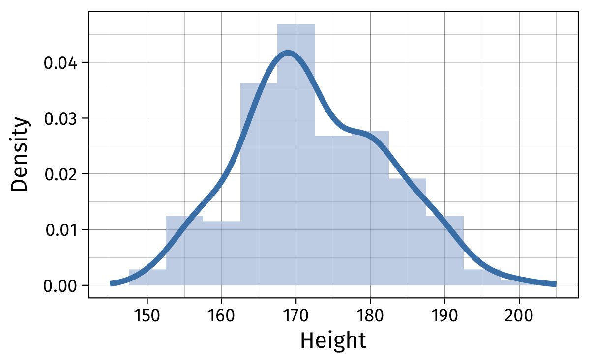

+ `03-graphics-figs.R`


## Boîte à moustaches ("boxplot")

Un diagramme de type boîte à moustaches [@tukey-1977-explor-data-analy] fournit une représentation graphique (ou schématique) du résumé numérique renvoyé par `summary()`.

`MASS::crabs` = "morphological measurements on 50 crabs each of two colour forms and both sexes, of the species Leptograpsus variegatus collected at Fremantle, W. Australia." 

8 variables : sp sex index FL RW CL CW BD

```r
> summary(crabs[["BD"]])
   Min. 1st Qu.  Median    Mean 3rd Qu.    Max. 
   6.10   11.40   13.90   14.03   16.60   21.60 
```

##  

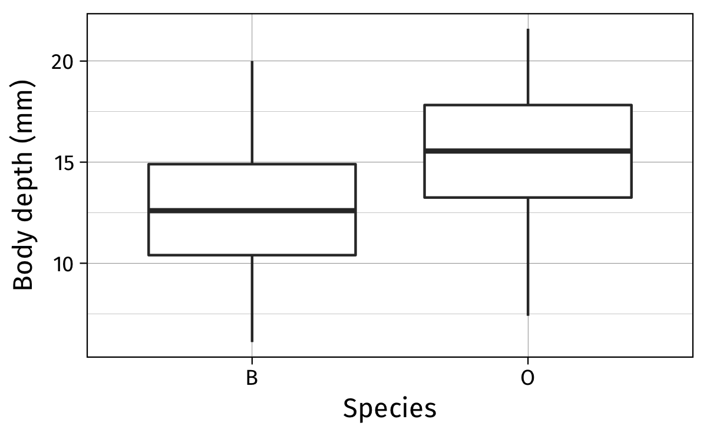

```r
p = ggplot(data = crabs, aes(x = sp, y = BD))
p + geom_boxplot()
```

## Changement de format (large → long)

Le package `reshape2` fournit deux commandes qui permettent d'alterner entre le format large (`dcast`) et long (`melt`). Cela permet, entre autres, de travailler avec des séries de mesure multivariées.

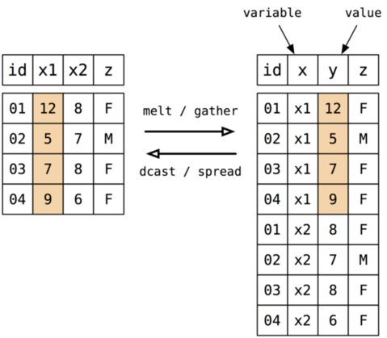

## Illustration

```r
crabs.df = reshape2::melt(crabs, measure.vars = 4:8)
p = ggplot(data = crabs.df, aes(x=variable, y=value))
p = p + geom_boxplot()
```

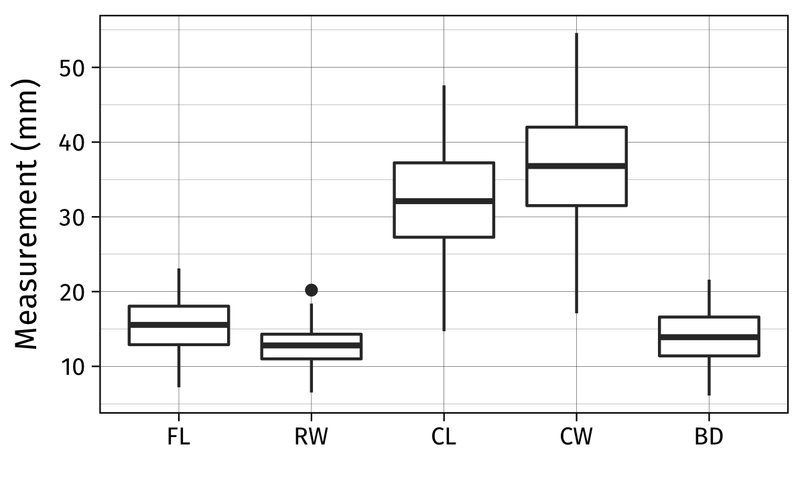


## Utilisation de facettes

Les "facettes" permettent de prendre en considération une ou plusieurs variables de conditionnement, e.g. une relation de type `Y ~ X | Z1` ou `Y ~ X | Z1 + Z2` [@becker-1996-visual-desig]. 

Ici, `Z1` et `Z2` peuvent être de type numérique ou discret (avec niveaux ordonnés ou non). Le conditionnement peut être rendu apparent *via* des attributs propres aux objets géométriques (couleur, forme, etc.) et/ou *via* des facettes.

```r
p = ggplot(data = crabs, 
           aes(x = CL, y = CW, color = sp))
p = p + geom_point(alpha = .7)
p + facet_wrap(~ sex)
```

##  

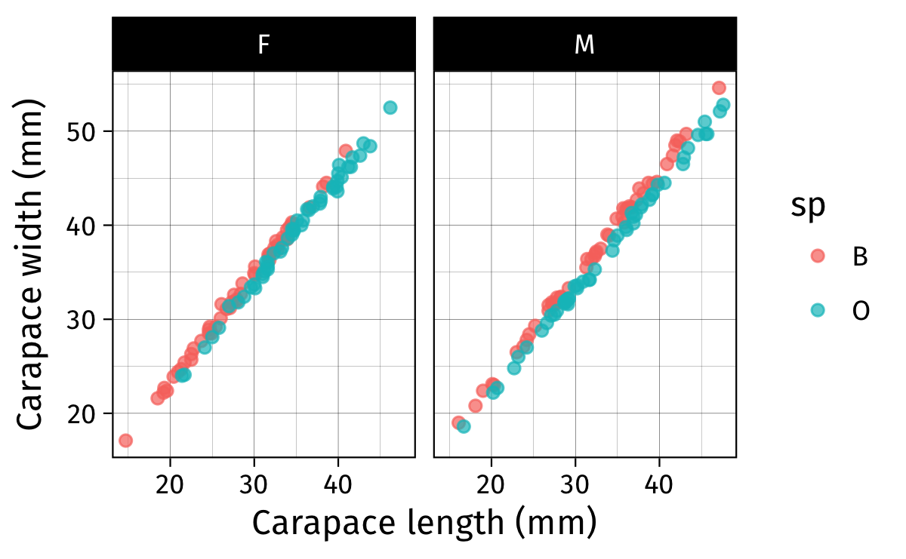


##  

```r
p = ggplot(data = crabs.df, aes(x = sp, y = value))
p = p + geom_boxplot()
p + facet_grid(~ variable)
```

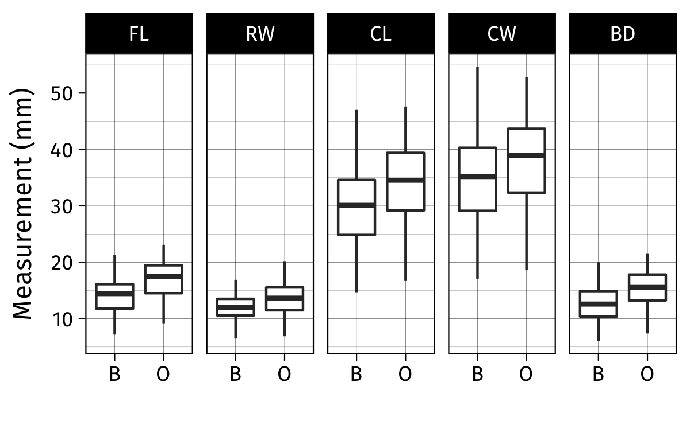


# Paramètres avancés


## Echelles et repères

- **type** : `scale_x_continuous(name, breaks, labels, limits =, trans =)`
- **limites** : `xlim()`, `ylim()`, `expand_limits()`, `limits =`
- **transformation** : `trans =`, `scale_y_log10()`, `coord_trans(y = "log10")`
- **format** `{scales}` : `scale_x_date(labels = date_format("%m/%d"))`, `annotation_logticks()`
- **propriétés** : `coord_flip()`, `coord_equal()`, `coord_polar()`

## Illustration

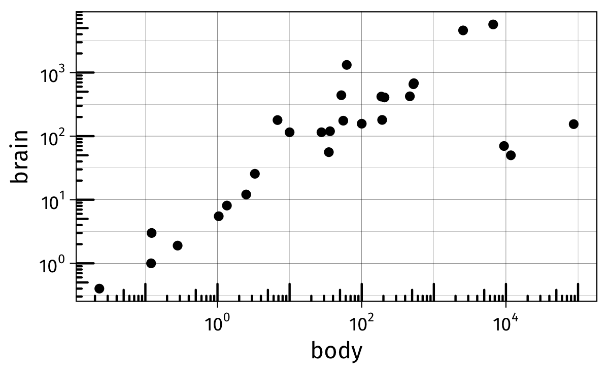

<http://www.sthda.com/french/wiki/ggplot2-echelle-et-transformation-des-axes-logiciel-r-et-visualisation-de-donnees>

## Changement de repère

Sans toucher au mapping (`aes()`) définissant le rôle joué par les variables, il est possible d'échanger les axes du repère cartésien :

```r
p = ggplot(data = crabs.df, 
           aes(x = variable, y = value))
p + geom_boxplot()
```

```r
p = ggplot(data = crabs.df, 
           aes(x = variable, y = value))
p = p + geom_boxplot()
p + coord_flip()
```

## Cas des facettes "libres"

```r
p = ggplot(data = subset(crabs.df, variable != "BD"), 
           aes(x = sp, y = value))
p = p + geom_boxplot()
p + facet_wrap(~ variable, nrow = 2, scales = "free")
```

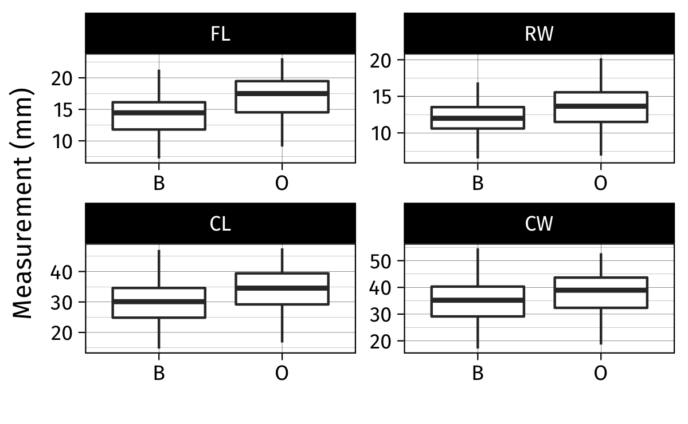


## Palettes "divergente" de couleurs

```r
p = ggplot(data = crabs, 
           aes(x = CL, y = CW, color = sp))
p = p + geom_point(alpha = .7)
p = p + scale_color_manual("Species", 
          values = c(grey(.3), 
                     "darkgoldenrod1"))      ## (1)
p = p + facet_wrap(~ sex)
```

```r
p + scale_color_brewer(palette = "Pastel1")  ## (1)
```

##  

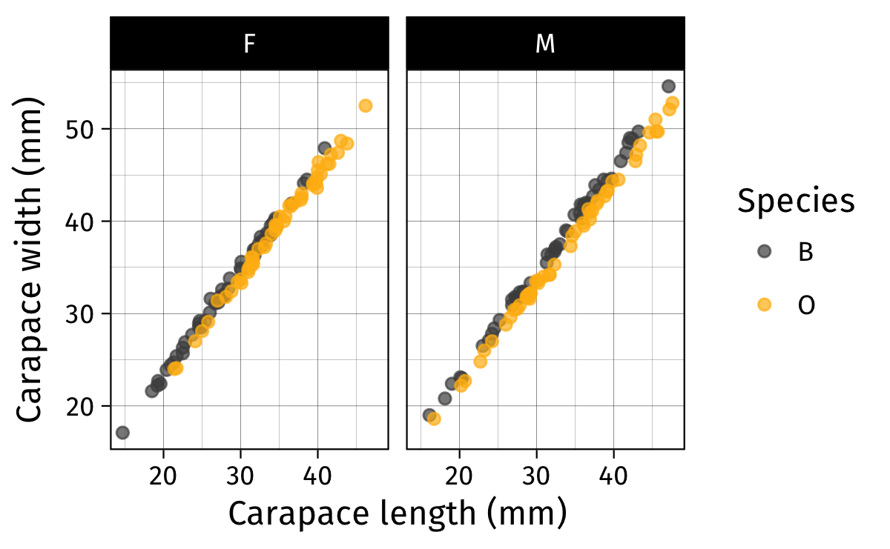


## Palette séquentielle (cas continu)

- <http://colorbrewer2.org>
- <http://hclwizard.org> 
- pour une discussion, voir @zeileis-2009-escap-rgblan

```r
p = ggplot(data = crabs, 
           aes(x = CL, y = CW, color = BD))
p = p + geom_point()
p = p + scale_color_distiller(palette = "OrRd") ## (1)
p = p + facet_grid(sp ~ sex)
```

```r
p <- p + scale_color_gradient()                 ## (1)
```

##  

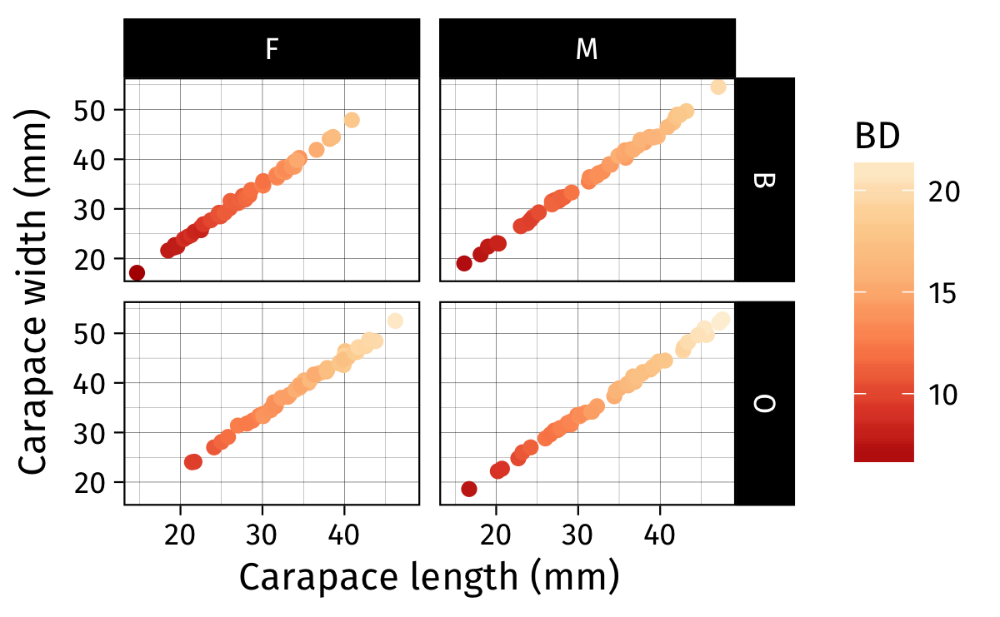

## Thèmes graphiques

- 8 thèmes de base, `ggplot2::theme_*` 
- [ggthemes][ggthemes], [ggthemr][ggthemr], [hrbrthemes][hrbrthemes]

À partir d'un thème de base, il est toujours possible de redéfinir soi-même certains éléments du thème.

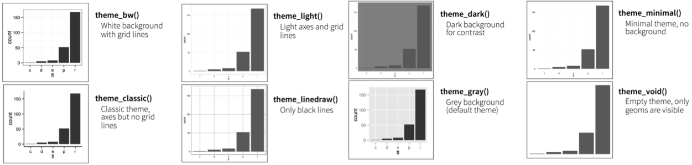


[ggthemes]: https://cran.r-project.org/web/packages/ggthemes/vignettes/ggthemes.html
[ggthemr]: https://github.com/cttobin/ggthemr
[hrbrthemes]: https://hrbrmstr.github.io/hrbrthemes/

# Graphiques interactifs

## Le package ggvis

<http://ggvis.rstudio.com>

- basé sur [Vega][vega] (projets connexes @ [UW Interactive Data Lab][uwidl], e.g. @wongsuphasawat-2016-voyag)
- intégration à RStudio ("Viewer")
- fonctionnalités plus limitées que `ggplot2`, mais dans l'esprit de l'approche [Shiny][shiny]


[vega]: https://vega.github.io/vega/
[uwidl]: https://idl.cs.washington.edu
[shiny]: http://shiny.rstudio.com

## Similarité avec ggplot

chaînage des couches (`layer`) avec `+` *versus* `{dplyr} %>%` :

```r
ggplot(data = birthwt, aes(x = lwt, y = bwt)) +
  geom_point() + 
  geom_smooth(method = "auto")
```

```r
ggvis(data = birthwt, ~ lwt, ~ bwt) %>% 
  layer_points() %>% 
  layer_smooths()
```

## Interactivité

```r
ggvis(data = birthwt, ~ lwt, ~ bwt) %>% 
  layer_points(fill := "cornflowerblue") %>% 
  layer_smooths(span = input_slider(0.5, 1.5, 
                                    value = 1))
```

```r
ggvis(data = survey, x = ~ Height) %>% 
  layer_densities(adjust = input_slider(0.1, 2, 
                                        value = 1, 
                                        step = 0.1))
```

##  

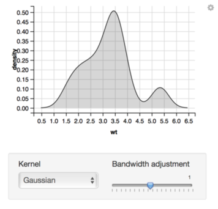


## plotly

Basé sur [plotly.js][plotlyjs], le package `plotly` permet de construire des graphiques interactifs ou d'embarquer directement des graphiques ggplot, publiables sur <https://plot.ly>.

```r
library(plotly)
p = ggplot(data = birthwt, aes(x = lwt, y = bwt)) +
      geom_point() + 
      geom_smooth(method = "auto")
ggplotly(p)
```

[plotlyjs]: https://plot.ly/javascript/

##  

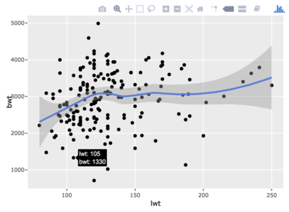


## References {.allowframebreaks}

