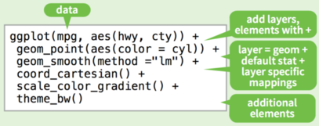

##  

> The greatest value of a picture is when it forces us to notice what we never expected to see.  
> ―John Tukey


# Les différents systèmes graphiques


# Le package ggplot2


## "The Grammar of Graphics"


- @wilkinson-2005-gramm-graph fournit un cadre de réflexion et des idées d'application d'une grammaire des graphiques
- @wickham-2009-ggplot offre une implémentation en langage R : <https://github.com/hadley/ggplot2-book>


## Un concept de couches


<https://roadtolarissa.com/hurricane/>


## Les bases d'un graphique ggplot

- `ggplot()` : un data frame (`data =`) et un mapping (`aes()`)
- `geom_*()` : un ou plusieurs objets géométriques
- `facet_wrap()` : un système de facettes (conditionnement)
- `scale_*_*()` : une échelle pour les axes ou les palettes de couleurs
- `coord_*()` : un système de coordonnées
- `labs()` : des annotations pour les axes et le graphique
- `theme_*()` : un thème personnalisé

##  



[ggplot2-cheatsheet.pdf](https://www.rstudio.com/wp-content/uploads/2015/03/ggplot2-cheatsheet.pdf)[^1]

[^1]: version plus récente disponible sur le [site de RStudio](https://www.rstudio.com/resources/cheatsheets/).

## Mise en œuvre

```r
p = ggplot() +
    layer(data = MASS::birthwt,
          stat = "identity",
          geom = "point",
          mapping = aes(x = lwt, y = bwt),
          position = "identity") +
    layer(data = MASS::birthwt,
          stat = "smooth",
          geom = "line",
          mapping = aes(x = lwt, y = bwt),
          position = "identity",
          params = list(method = "auto"))
```

##  


## Syntaxe ggplot

Formulation équivalente et simplifiée :

```r
library(MASS)
p = ggplot(data = birthwt, aes(x = lwt, y = bwt))
p + geom_point() + geom_smooth(method = "auto")
```

→ structure graphique (`ggplot`) et objets géométriques (`geom_*`).

## Histogramme d'effectifs

`MASS::survey` = "responses of 237 Statistics I students at the University of Adelaide to a number of questions." [@venables-2002-moder-applied]

12 variables : `Sex` `Wr.Hnd` `NW.Hnd` `W.Hnd` `Fold` `Pulse` `Clap` `Exer` `Smoke` `Height` `M.I` `Age`

```r
p = ggplot(data = survey, aes(x = Height))
p + geom_histogram(binwidth = 5)  ## bins = 11
```

##  


## Courbe de densité

```r
p = ggplot(data = survey, aes(x = Height))
p + geom_density(adjust = 0.8)  ## (1)
```

On peut également construire une courbe de densité explicitement à l'aide de `geom_line()`

```r
p + geom_line(stat = "density", ...)  ## (1)
```

##  


## Estimateur

@venables-2002-moder-applied, *§5.6 – Density Estimation* (pp. 126–130)

$$ \hat f(x) = \frac{1}{nb}\sum_{j=1}^n K\left(\frac{x-x_j}{b}\right) $$

$x_1,\dots,x_n$ un échantillon de taille $n$  
$K()$ une fonction noyau fixée, par défaut gaussienne  
$\hat b = 1.06\:\textrm{min}(\hat\sigma, \textrm{IQR}/1.34)\: n^{-1/5}$ la largeur de la fenêtre de lissage.


## Histogramme d'effectifs revisité


+ `03-graphics-figs.R`

# Paramètres avancés


# Visualisation de données spatiales


# Visualisation de données temporelles


## References

