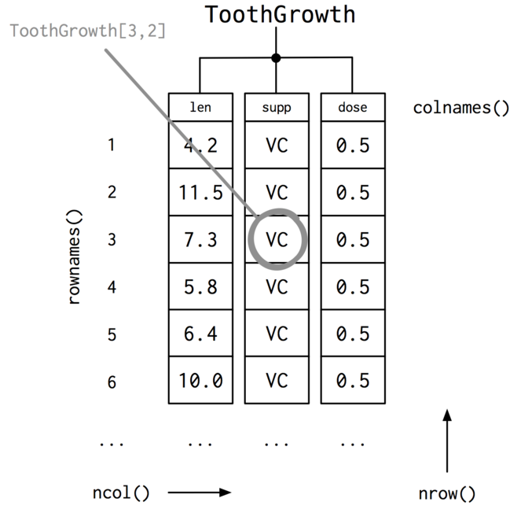
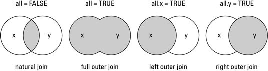
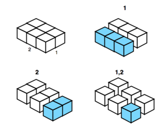
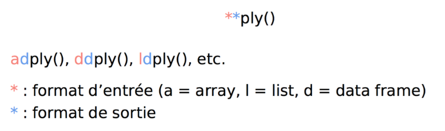
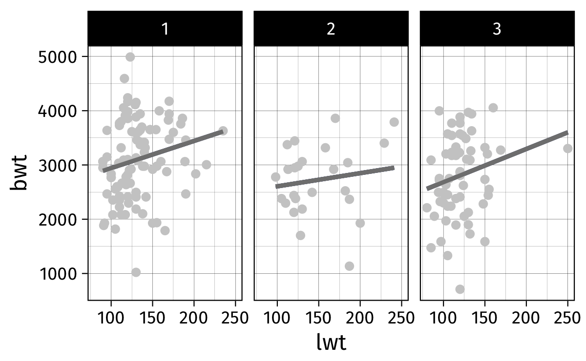
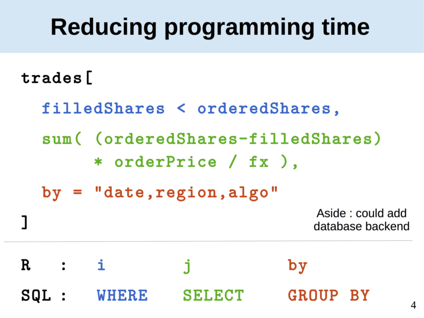
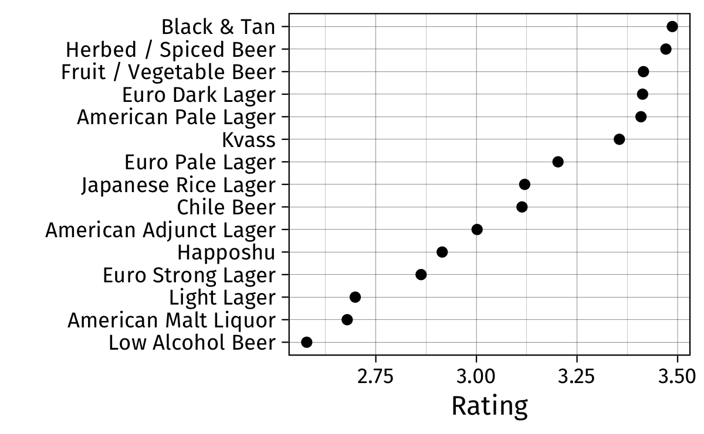
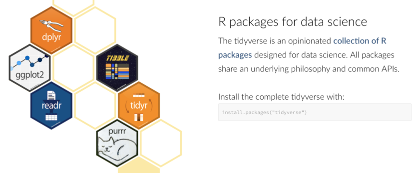

# Data frames


## Les data frames



##  


    > data(ToothGrowth)
    > str(ToothGrowth)
    'data.frame':	60 obs. of  3 variables:
     $ len : num  4.2 11.5 7.3 5.8 6.4 10 11.2 11.2 5.2 7 ...
     $ supp: Factor w/ 2 levels "OJ","VC": 2 2 2 2 2 2 2 2 2 2 ...
     $ dose: num  0.5 0.5 0.5 0.5 0.5 0.5 0.5 0.5 0.5 0.5 ...
    > head(ToothGrowth, n = 3)
       len supp dose
    1  4.2   VC  0.5
    2 11.5   VC  0.5
    3  7.3   VC  0.5


## Manipulation d'un data frame

Sélection indexée : notation matricielle `[i,j]` (ligne, colonne), approche de type liste, ou utilisation des noms de variable (`$`)

```r
ToothGrowth[1,]
ToothGrowth[c(1,3),]
ToothGrowth[1:5, 2]
ToothGrowth[1:5, "supp"]
ToothGrowth$supp[1:5]
ToothGrowth[["supp"]]
```

## Manipulation d'un data frame (con't)

Sélection critériée : usage de filtres logiques `==`, `!=`, `>`, `>=`, `<`, `<=`, `%in%`, et connecteurs `&`, `|`

```r
ToothGrowth[ToothGrowth$supp == "VC" &
            ToothGrowth$dose == 0.5, "len"]
ToothGrowth$supp[ToothGrowth$len < 11]
```

Utilisation de la commande `subset` : 
```r
subset(ToothGrowth, supp == "VC" & dose == 0.5, len)
```

## Facteurs 

```r
ToothGrowth$dose.cat = factor(ToothGrowth$dose, 
                              levels = c(0.5, 1, 2),
                              labels = c("lo","mi","hi"))
nlevels(ToothGrowth$dose.cat)
levels(ToothGrowth$dose.cat)[1:2] = "lo+mi"
```

Pour supprimer une variable, on utilise la syntaxe suivante :
```r
ToothGrowth$dose.cat = NULL
```

## Fusion de sources

```r
data(crabs, package = "MASS")
A = crabs[,c("index","sp","sex")]
B = crabs[,c("index","FL","RW","CL","CW","BD")]
AB = merge(A, B, by = "index")
```




## Aggrégation de données
La commande `aggregate()` permet de construire des résumés numériques agrégés selon les niveaux d'un ou plusieurs facteurs :


```r
aggregate(BD ~ sp, data = crabs, mean)
f = function(x) c(mean = mean(x), s = sd(x))
r = aggregate(BD ~ sp + sex, data = birthwt, f)
```

Notation par formule assez pratique pour les modèles statistiques sous R ou le package `lattice` pour les graphiques.


## Split, apply, combine

> (...) break up a big problem into manageable pieces, operate on each piece independently and then put all the pieces back together 
> – Hadley Wickham (2011)



## Base *versus* plyr


```r
spl = with(crabs, split(BD, sp))
apl = lapply(spl, mean)
cbn = rbind(x = apl)
cbn
```


```r
library(plyr)
ddply(data = crabs, .(sp), summarize, x = mean(BD))
## ddply(crabs, "sp", summarize, x = mean(BD))
```

##  

```r
d = data.frame(x = rnorm(1e6), 
			   g = sample(c(0,1), 1e6, replace = TRUE))
dim(d)
format(object.size(d), "Mb")
system.time(aggregate(x ~ g, d, mean))
library(plyr)
system.time(ddply(d, "g", summarise, mean(x)))
```

## Le "zoo" des commandes plyr



Exemple : 
```r
labs = c("w", "b", "o")
birthwt = mutate(birthwt, 
                 race = factor(race, 
                               labels = labs))
f = function(d) lm(bwt ~ lwt, data = d)
m = dlply(birthwt, "race", f)
ldply(m, coef)
```

##  




# Data tables

## Le package data.table

<https://github.com/Rdatatable/data.table/wiki>

Système de gestion d'un data frame inspiré du traitement des bases de données relationnelles, et orienté vers les gros volumes de données (finance, génétique, etc.). 

La rapidité des opérations provient de l'utilisation d'un système d'index et de traitements par référence (et non par recopie).

Tutoriel : <http://user2014.stat.ucla.edu/files/tutorial_Matt.pdf> 

## Lignes, colonnes, groupes



## Opérations de base

- La plupart des commandes sont placées à l'intérieur des crochets
- Quelques exceptions : `setkey()` (tri d'un data table selon une ou plusieurs colonnes, indispensable pour les jointures), `set()` (mise à jour de lignes ou colonnes)
- Nombreux exemples (trucs & astuces) : <http://brooksandrew.github.io/simpleblog/articles/advanced-data-table/>


## Illustration

"(...) data from Beer Advocate, a community of beer enthusiasts and industry professionals dedicated to supporting and promoting beer. It consists of about 1.5 millions reviews posted on BeerAdvocate from 1999 to 2011. Each record is composed of a beer's name, brewery, and metadata like style and ABV etc., along with ratings provided by reviewers. Beers are graded on appearance, aroma, palate, and taste plus users provide an overall grade. All ratings are on a scale from 1 to 5 with 5 being the best."

<http://blog.yhat.com/posts/recommender-system-in-r.html>

## Lecture des données

    > system("wc -l data/beer_reviews.csv")
    1586615 data/beer_reviews.csv
    > system.time(read.csv("data/beer_reviews.csv"))
    utilisateur     système      écoulé
         24.297       0.319      24.636
    > system.time(data.table::fread("data/beer_reviews.csv"))
    utilisateur     système      écoulé
          1.613       0.066       1.690

## Sélection, projection et insertion

```r
library(data.table)
dt = fread("data/beer_reviews.csv")
ratings = c("review_overall", "review_aroma", 
            "review_palate", "review_taste")
dt[review_overall < 1]
dt[review_overall > 4 & 
   beer_style %in% c("Czech Pilsener",
                     "German Pilsener")]
setkey(dt, "beer_beerid")
dt[, .N, by = beer_style]
dt[, orating := review_overall < 3.5]
```

## Application

```r
length(unique(dt$beer_style))
r = dt[, mean(review_overall), by = beer_style]
r = r[order(V1)]
names(r) = c("style", "rating")
p = ggplot(data = subset(r, rating < 3.5), 
           aes(x = reorder(style, rating), 
			   y = rating))
p = p + geom_point() 
p + labs(x = "", y = "Rating") + coord_flip() 
```

##  




# Tibbles

## Le package dplyr

[dplyr][dplyr] = `plyr` + structure de données avancée + grammaire des données ("verbs"), en lien avec l'approche [OLAP][olap].

Ce package s'intègre, avec ou sans `magrittr`, dans l'écosystème `readr`/`readxl`/`haven`, `tidyr` et `ggplot2` (`ggvis`).

 

> dplyr is a new package which provides a set of tools for efficiently manipulating datasets in R. dplyr is the next iteration of plyr, focussing on only data frames. dplyr is faster, has a more consistent API and should be easier to use.  
> – Hadley Wickham (2015)


[dplyr]: http://blog.rstudio.org/2014/01/17/introducing-dplyr/
[olap]: https://en.wikipedia.org/wiki/Online_analytical_processing

## Tidyverse




## Commandes essentielles

- `group_by()` : factorisation (`split`)
- `summarise()` : aggrégation (`aggregate`)
- `mutate()` : opération interne au data frame (`transform`)
- `filter()` : sélection de lignes (`subset`)
- `select()` : sélection de colonnes (projection) (`subset`)
- `arrange()` : tri d'un data frame selon des variables (`order`)

## "Tibbles"

    > tbl_df(dt)
    # A tibble: 1,586,614 x 13
       brewery_id            brewery_name review_time 
            <int>                   <chr>       <int> 
     1      10325         Vecchio Birraio  1234817823 
     2      10325         Vecchio Birraio  1235915097 
     3      10325         Vecchio Birraio  1235916604 
     4      10325         Vecchio Birraio  1234725145 
     5       1075 Caldera Brewing Company  1293735206 
     6       1075 Caldera Brewing Company  1325524659 
     7       1075 Caldera Brewing Company  1318991115 
     8       1075 Caldera Brewing Company  1306276018 
     9       1075 Caldera Brewing Company  1290454503 
    10       1075 Caldera Brewing Company  1285632924 
    # ... with 1,586,604 more rows, and 8 more variables:


## Connexion à des bases de données

    > tbl(src_sqlite("data/chinook.sqlite"), "Album")
    # Source:   table<Album> [?? x 3]
    # Database: sqlite 3.19.3
    #   [/Users/chl/Documents/git/rstats-esme/data/chinook.sqlite]
       AlbumId                                 Title
         <int>                                 <chr>
     1       1 For Those About To Rock We Salute You
     2       2                     Balls to the Wall
     3       3                     Restless and Wild
     4       4                     Let There Be Rock
     5       5                              Big Ones
     6       6                    Jagged Little Pill
     7       7                              Facelift
     8       8                        Warner 25 Anos
     9       9        Plays Metallica By Four Cellos
    10      10                            Audioslave


## dplyr versus plyr

```r
detach(package:plyr)
library(dplyr)
dd <- group_by(d, grp)
summarise(dd, x = mean(x))
```

Notation alternative (pipe, `magrittr`) :

```r
d %>% group_by(grp) %>% summarise(x = mean(x))
```

