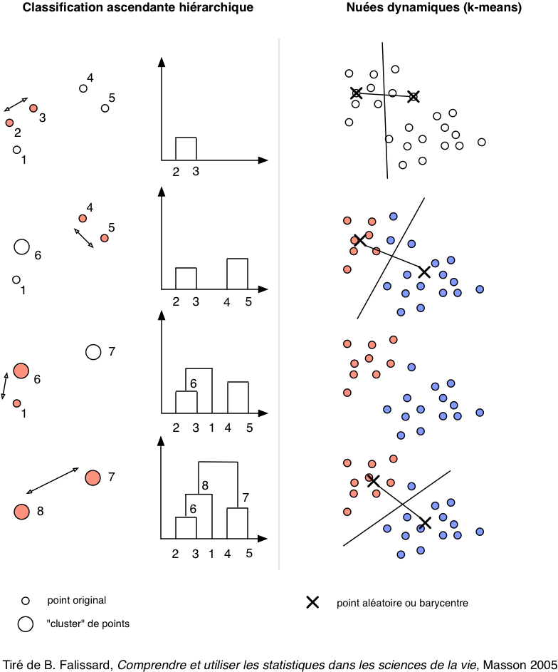
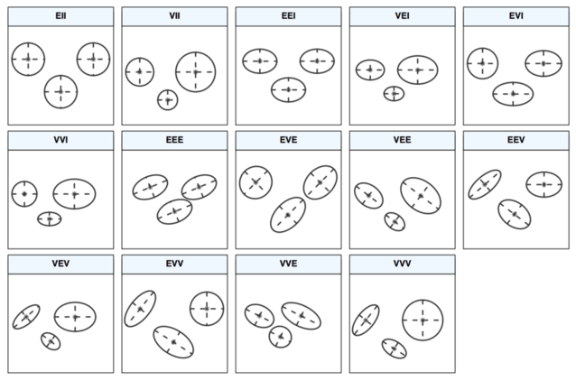
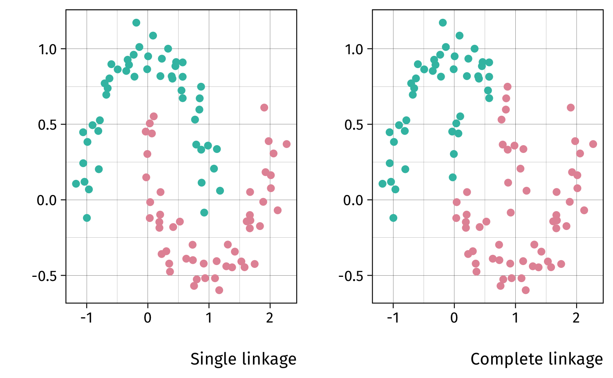
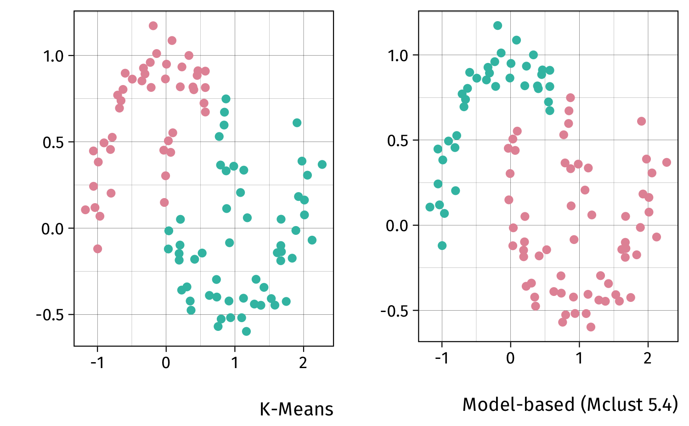
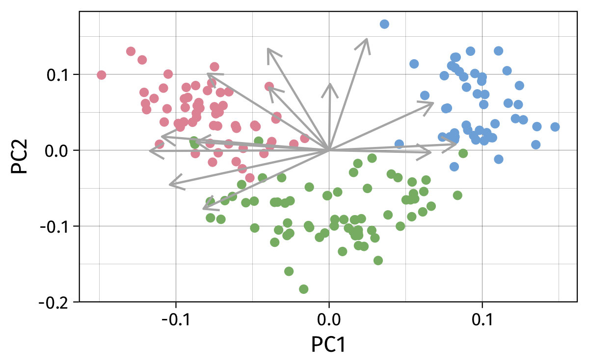

# Data Mining & Co.

## Approches supervisées et non-supervisées

Approche supervisée :

- statut (classe, mesure) connu à l'avance : modèle prédictif basé sur une approche par classification ou régression
- optimisation de la qualité prédictive du modèle
- validation croisée pour l'estimation des hyper-paramètres du modèle final
- Exemples : A/B testing, régression, Random Forest, Support Vector Machine, etc.


##  

Approche non supervisée :

- statut inconnu
- identifier des groupes d'unités statistiques partageant des caractéristiques communes ou présentant un certain degré de similarité
- mesurer la co-occurence d'événements ou la fréquence de motifs plus ou moins réguliers
- Exemples : classification automatique ("clustering"), système de recommendation et filtrage collaboratif, text mining, etc.

##  

 en ML](../assets/img_sklearn.png)

## Data mining *versus* machine learning

> [What is the difference between data mining, statistics, machine learning and AI?][cv5026]
-- Cross Validated Q & A


Il y a peu de définition consensuelle sur la distinction entre statistiques, apprentissage artificiel, fouille de données, intelligence artificielle. 

On retiendra que les techniques de data mining se sont développées pour répondre à des besoins d'analyse de gros volumes de données pour lesquels un point critique est de disposer d'outils efficaces en termes de ressources mémoire et de temps de calcul [@murphy-2012-machin-learn].

[cv5026]: https://stats.stackexchange.com/q/5026

## Lectures conseillées

ISLR §10.2 et §10.3

1. Classsification automatique (`hclust`, `kmeans`, `{fpc}`, `{Mclust}`) :  
[Cluster Analysis: Basic Concepts and Algorithms][ca] (PDF 1.3MB) 
2. Analyse en composantes principales (`prcomp`, `{FactoMineR}`):  
[A tutorial on Principal Component Analysis][pca] (PDF 12pp.)
3. Règles d'association et frequent itemset (`{arules}`) :  
[Association Analysis: Basic Concepts and Algorithms][ar] (PDF 612KB)

[ca]: http://www-users.cs.umn.edu/~kumar/dmbook/ch8.pdf
[ar]: http://www-users.cs.umn.edu/~kumar/dmbook/ch6.pdf
[pca]: http://arxiv.org/pdf/1404.1100.pdf

# Mesures d'association et de similarité

## Mesurer l'association entre deux variables

- distance et (dis)similarité, voir pour une revue dans le cas des variables numériques @shirkhorshidi-2015-compar-study
- Minkowski : $d(x,y) = \left( \sum_i \vert x_i - y_i \vert^p \right)^{1/p}$

Une "fonction" distance, $f(x,y)$, doit vérifier certaines propriétés : 

1. $f(x,y)\geq 0$, 
2. $f(x,y)=0\Leftrightarrow x = y$, 
3. $f(x,y)=f(y,x)$,
4. $f(x,y)\leq f(x,z)+f(y,z)$ (inégalité triangulaire).


## Classification hiérarchique

    
- mesure de dissimilarité ou de distance entre chaque paire d'observation : $\vert\vert x-y\vert\vert_2$ (euclidienne), $\vert\vert x-y\vert\vert_2^2$, $\vert\vert x-y\vert\vert_1$
- Méthode d'aggrégation : 

    1. ascendante : chaque observation définit son propre cluster, puis on regroupe les clusters par paires et on itère jusqu'à n'avoir plus qu'un seul cluster ;
    2. descendante : on part d'un seul cluster et on divise.
- critère d'agglomération : complete, single, average, centroid, diminution de la variance intra-classe (Ward), etc.

## Nuées dynamiques (k-means)

- "aggrégation en centres mobiles" : regroupement itératif des observations par minimisation de la variance intra-cluster, après initialisation aléatoire des centres de classe
- choix d'une fonction distance : euclidienne, Manhattan (k-medians), et bien d'autres (k-medoids ou PAM)


```r
s = 1234
k = 10
wss = numeric(k)
wss[1] = (nrow(data)-1) * sum(sapply(data, var))
for (i in 2:k) {
  set.seed(s)
  wss[i] = sum(kmeans(data, centers = i)$withinss)
}
```

##  




## Modèle de mélange

Les modèles de mélange permettent de spécifier la forme de la matrice de variance-covariance des clusters. La distribution (non-conditionnelle des observations) s'écrit :
$$
\begin{array}{l}
p(x_i) = \sum_{c=1}^k\pi_cp(x_i\mid c) \\
x_i\mid c \sim \text{N}(\mu_c,\Sigma_x)
\end{array}
$$
Dans le cas où $\Sigma_x = \sigma^2I$, on retrouve les k-means. 

La sélection du "meilleur modèle" (VC forme et direction) repose sur le critère BIC (Bayesian Information Criteria).

Ce type d'approche est également utilisables en classification (approche supervisée).


##  




## Illustration des approches de classification automatique


## Application

```r
## 05-data-mining-1-figs.R
hc.s <- hclust(dist(moon), method = "single")
hc.c <- hclust(dist(moon), method = "complete")

km <- kmeans(moon, centers = 2, nstart = 25)
mc <- Mclust(moon, G = 2)
```


##  



##  




# Réduction de dimension

## ACP et réduction de dimension

L'analyse en composantes principales (ACP) permet de réduire la dimensionalité d'un tableau de données en construisant des combinaisons linéaires successives des variables, toutes orthogonales entre elles.

Méthodes connexes : positionnement/échelonnement multidimensionnel (MDS), analyse discriminante linéaire (LDA), [gene shaving][gensave], analyse canonique des corrélations, analyse de coinertie.

ACP couplée à une classification : Si $u_1$ et $u_2$ désignent les deux premières combinaisons linéaires des variables du tableau $X$, alors $(Xu_1,Xu_2)$ fournissent les coordonnées des individus dans le plan factoriel défini par les deux premières dimensions de l'ACP. À partir de là, il est possible d'appliquer une procédure de classification automatique pour vérifier la présence de classes homogènes d'individus (package `{FactoClass}`).

[gensave]: https://www.stat.washington.edu/wxs/Stat592-w2011/Literature/shave.pdf

##  

![[Dimensionality Reduction Methods for Molecular Motion][pcalink]](../assets/img_pca.jpg)

[pcalink]: http://cnx.org/contents/02ff5dd2-fe30-4bf5-8e2a-83b5c3dc0333@10/Dimensionality_Reduction_Metho


## Application

Wine recognition data (Updated Sept 21, 1998), [Archives UCI][uciml]

178 observations, 13 variables (Alcohol, Malic acid, Ash, Alcalinity of ash, Magnesium, Total phenols, Flavanoids, Nonflavanoid phenols, Proanthocyanins, Color intensity, Hue, OD280/OD315 of diluted wines, Proline)

```r
w = read.table("data/wine.csv", sep = ",")
names(w) <- c("Type","Alcohol","Malic","Ash",
              "Alcalinity","Magnesium","Phenols",
              "Flavanoids","Nonflavanoids",
              "Proanthocyanins","Color","Hue",
              "Dilution","Proline")
pca <- prcomp(w[,-1], center = TRUE, scale = TRUE)
```

[uciml]: http://archive.ics.uci.edu/ml/datasets/Wine

##  




# Frequent item set


## References {.allowframebreaks}

