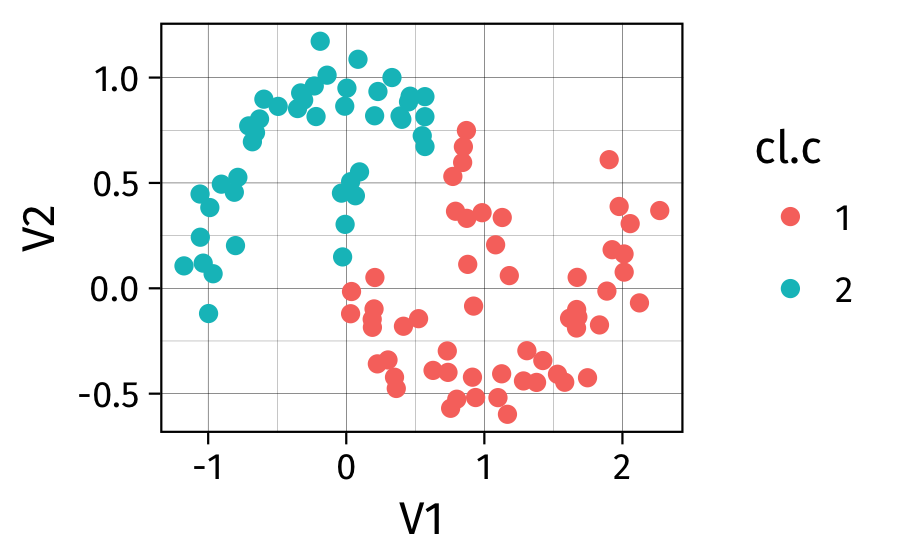

# Data Mining & Co.

## Approches supervisées et non-supervisées

Approche supervisée :

- statut (classe, mesure) connu à l'avance : modèle prédictif basé sur une approche par classification ou régression
- optimisation de la qualité prédictive du modèle
- validation croisée pour l'estimation des hyper-paramètres du modèle final
- Exemples : A/B testing, régression, Random Forest, Support Vector Machine, etc.

##  

Approche non supervisée :

- statut inconnu
- identifier des groupes d'unités statistiques partageant des caractéristiques communes ou présentant un certain degré de similarité
- mesurer la co-occurence d'événements ou la fréquence de motifs plus ou moins réguliers
- Exemples : classification automatique ("clustering"), système de recommendation et filtrage collaboratif, text mining, etc.

##  

 en ML](../assets/img_sklearn.png)

## Data mining *versus* machine learning

Il y a peu de définition consensuelle sur la distinction entre statistiques, apprentissage artificiel, fouille de données, intelligence artificielle. On retiendra que les techniques de data mining se sont développées pour répondre à des besoins d'analyse de gros volumes de données pour lesquels un point critique est de disposer d'outils efficaces en termes de ressources mémoire et de temps de calcul [@murphy-2012-machin-learn].

## Lectures conseillées

1. Classsification automatique (`hclust`, `kmeans`, `fpc`) :  
[Cluster Analysis: Basic Concepts and Algorithms][ca] (PDF 1.3MB) 
2. Règles d'association et frequent itemset (`arules`) :  
[Association Analysis: Basic Concepts and Algorithms][ar] (PDF 612KB)

[ca]: http://www-users.cs.umn.edu/~kumar/dmbook/ch8.pdf
[ar]: (http://www-users.cs.umn.edu/~kumar/dmbook/ch6.pdf

# Mesures d'association et de similarité

## Mesurer l'association entre deux variables

souvent utilisé pour les profiles d'expression génique [@shirkhorshidi-2015-compar-study]

## Notion de distance

## Notion de (dis)similarité

## Illustration

##  

# Réduction de dimension

# Frequent item set

## References {.allowframebreaks}

