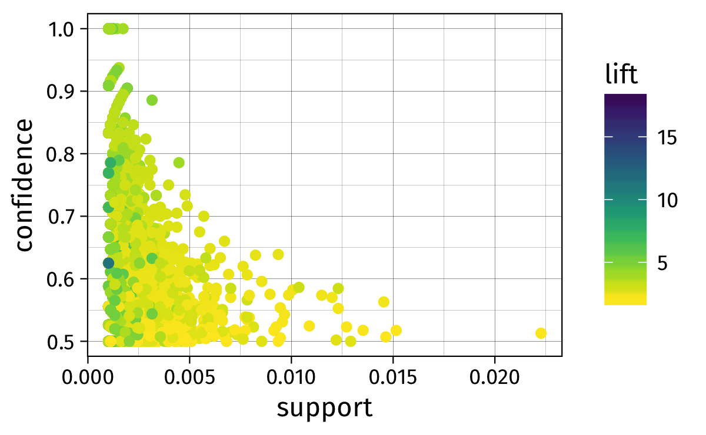
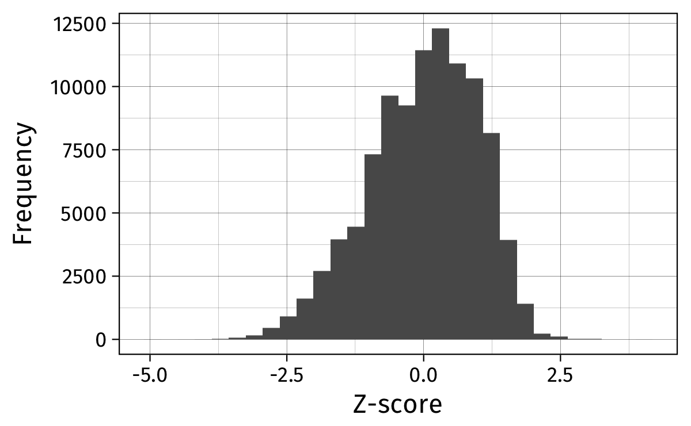

# Data Mining & Co.

## Approches supervisées et non-supervisées

Approche supervisée :

- statut (classe, mesure) connu à l'avance : modèle prédictif basé sur une approche par classification ou régression
- optimisation de la qualité prédictive du modèle
- validation croisée pour l'estimation des hyper-paramètres du modèle final
- Exemples : A/B testing, régression, Random Forest, Support Vector Machine, etc.


##  

Approche non supervisée :

- statut inconnu
- identifier des groupes d'unités statistiques partageant des caractéristiques communes ou présentant un certain degré de similarité
- mesurer la co-occurence d'événements ou la fréquence de motifs plus ou moins réguliers
- Exemples : classification automatique ("clustering"), système de recommendation et filtrage collaboratif, text mining, etc.

##  

 en ML](../assets/img_sklearn.png)

## Data mining *versus* machine learning

> [What is the difference between data mining, statistics, machine learning and AI?][cv5026]
-- Cross Validated Q & A


Il y a peu de définition consensuelle sur la distinction entre statistiques, apprentissage artificiel, fouille de données, intelligence artificielle. 

On retiendra que les techniques de data mining se sont développées pour répondre à des besoins d'analyse de gros volumes de données pour lesquels un point critique est de disposer d'outils efficaces en termes de ressources mémoire et de temps de calcul [@murphy-2012-machin-learn].

[cv5026]: https://stats.stackexchange.com/q/5026

## Lectures conseillées

1. Classsification automatique (`hclust`, `kmeans`, `{fpc}`, `{Mclust}`) :  
[Cluster Analysis: Basic Concepts and Algorithms][ca] (PDF 1.3MB) 
2. Analyse en composantes principales (`prcomp`, `{FactoMineR}`):  
[A tutorial on Principal Component Analysis][pca] (PDF 12pp.)
3. Règles d'association et frequent itemset (`{arules}`) :  
[Association Analysis: Basic Concepts and Algorithms][ar] (PDF 612KB)
4. Filtrage collaboratif et recommendation (`{recommenderlab}`) :  
[Collaborative Filtering Recommender Systems][rs] (PDF 557KB)

[ca]: http://www-users.cs.umn.edu/~kumar/dmbook/ch8.pdf
[ar]: http://www-users.cs.umn.edu/~kumar/dmbook/ch6.pdf
[pca]: http://arxiv.org/pdf/1404.1100.pdf
[rs]: http://files.grouplens.org/papers/FnT%20CF%20Recsys%20Survey.pdf

# Mesures d'association et de similarité

## Mesurer l'association entre deux variables

- distance et (dis)similarité, voir pour une revue dans le cas des variables numériques @shirkhorshidi-2015-compar-study
- Minkowski : $d(x,y) = \left( \sum_i \vert x_i - y_i \vert^p \right)^{1/p}$

Une "fonction" distance, $f(x,y)$, doit vérifier certaines propriétés : 

1. $f(x,y)\geq 0$, 
2. $f(x,y)=0\Leftrightarrow x = y$, 
3. $f(x,y)=f(y,x)$,
4. $f(x,y)\leq f(x,z)+f(y,z)$ (inégalité triangulaire).


## Classification hiérarchique

    
- mesure de dissimilarité ou de distance entre chaque paire d'observation : $\vert\vert x-y\vert\vert_2$ (euclidienne), $\vert\vert x-y\vert\vert_2^2$, $\vert\vert x-y\vert\vert_1$
- Méthode d'aggrégation : 

    1. ascendante : chaque observation définit son propre cluster, puis on regroupe les clusters par paires et on itère jusqu'à n'avoir plus qu'un seul cluster ;
    2. descendante : on part d'un seul cluster et on divise.
- critère d'agglomération : complete, single, average, centroid, diminution de la variance intra-classe (Ward), etc.

## Nuées dynamiques (k-means)

- "aggrégation en centres mobiles" : regroupement itératif des observations par minimisation de la variance intra-cluster, après initialisation aléatoire des centres de classe
- choix d'une fonction distance : euclidienne, Manhattan (k-medians), et bien d'autres (k-medoids ou PAM)


```r
s = 1234
k = 10
wss = numeric(k)
wss[1] = (nrow(data)-1) * sum(sapply(data, var))
for (i in 2:k) {
  set.seed(s)
  wss[i] = sum(kmeans(data, centers = i)$withinss)
}
```

##  


## Modèle de mélange

Les modèles de mélange permettent de spécifier la forme de la matrice de variance-covariance des clusters. La distribution (non-conditionnelle des observations) s'écrit :
$$
\begin{array}{l}
p(x_i) = \sum_{c=1}^k\pi_cp(x_i\mid c) \\
x_i\mid c \sim \text{N}(\mu_c,\Sigma_x)
\end{array}
$$
Dans le cas où $\Sigma_x = \sigma^2I$, on retrouve les k-means. 

La sélection du "meilleur modèle" (VC forme et direction) repose sur le critère BIC (Bayesian Information Criteria).

Ce type d'approche est également utilisables en classification (approche supervisée).


##  


## Illustration des approches de classification automatique


## Application

```r
## 05-data-mining-1-figs.R
hc.s <- hclust(dist(moon), method = "single")
hc.c <- hclust(dist(moon), method = "complete")

km <- kmeans(moon, centers = 2, nstart = 25)
mc <- Mclust(moon, G = 2)
```


##  


##  


# Réduction de dimension

## ACP et réduction de dimension

L'analyse en composantes principales (ACP) permet de réduire la dimensionalité d'un tableau de données en construisant des combinaisons linéaires successives des variables, toutes orthogonales entre elles.

Méthodes connexes : positionnement/échelonnement multidimensionnel (MDS), analyse discriminante linéaire (LDA), [gene shaving][gensave], analyse canonique des corrélations, analyse de coinertie.

ACP couplée à une classification : Si $u_1$ et $u_2$ désignent les deux premières combinaisons linéaires des variables du tableau $X$, alors $(Xu_1,Xu_2)$ fournissent les coordonnées des individus dans le plan factoriel défini par les deux premières dimensions de l'ACP. À partir de là, il est possible d'appliquer une procédure de classification automatique pour vérifier la présence de classes homogènes d'individus (package `{FactoClass}`).

[gensave]: https://www.stat.washington.edu/wxs/Stat592-w2011/Literature/shave.pdf

##  

![[Dimensionality Reduction Methods for Molecular Motion][pcalink]](../assets/img_pca.jpg)

[pcalink]: http://cnx.org/contents/02ff5dd2-fe30-4bf5-8e2a-83b5c3dc0333@10/Dimensionality_Reduction_Metho


## Application

Wine recognition data (Updated Sept 21, 1998), [Archives UCI][uciml]

178 observations, 13 variables (Alcohol, Malic acid, Ash, Alcalinity of ash, Magnesium, Total phenols, Flavanoids, Nonflavanoid phenols, Proanthocyanins, Color intensity, Hue, OD280/OD315 of diluted wines, Proline)

```r
w = read.table("data/wine.csv", sep = ",")
names(w) <- c("Type","Alcohol","Malic","Ash",
              "Alcalinity","Magnesium","Phenols",
              "Flavanoids","Nonflavanoids",
              "Proanthocyanins","Color","Hue",
              "Dilution","Proline")
pca <- prcomp(w[,-1], center = TRUE, scale = TRUE)
```

[uciml]: http://archive.ics.uci.edu/ml/datasets/Wine

##  


# Règles d'association


## Règles d'association et items fréquents

Règle d'association simple : si item1 alors item2, {item1} → {item2}.

Idée générale : rechercher des itemsets fréquents (support ≥ min support) et construire des règles d'association à partir de ces itemsets ("Market Basket analysis" ou [affinity analysis][affanalytics]).

Packages `arules` (algorithme APRIORI et ECLAT) et `arulesViz`.


[affanalytics]: https://en.wikipedia.org/wiki/Affinity_analysis


## Vocabulaire de base

- min support (supp) : % de transactions contenant l'itemset
- min confidence : $c(X \Rightarrow Y) = supp(X \cup Y)/supp(X)$
- max itemset : nombre d'items
- lift : $l(X \Rightarrow Y) = supp(X \cup Y)/(supp(X)\times supp(Y))$ (équiv. à rapport de vraisemblance)

Une "bonne" règle possède des valeurs de supp et conf élevées.


##  

](../assets/img_marketbasket.png)


- min support {milk, bread, butter} = 1/5
- lift {milk,bread} $\Rightarrow$ {butter} = 0.2/0.4x0.4 = 1.25 


## Illustration

`arulesViz::Groceries` = "The Groceries data set contains 1 month (30 days) of real-world point-of-sale transaction data from a typical local grocery outlet.  The data set contains 9835 transactions."

     
```r
> library(arulesViz)
> data(Groceries)
transactions in sparse format with
 9835 transactions (rows) and
 169 items (columns)
> summary(Groceries)
transactions as itemMatrix in sparse format with
 9835 rows (elements/itemsets/transactions) and
 169 columns (items) and a density of 0.02609146 
```


## Algorithme Eclat

```r
itemsets = eclat(Groceries, 
                 parameter = list(supp = 0.001, 
                                  maxlen = 3, 
                                  minlen = 2, 
                                  tidLists = TRUE))
summary(itemsets)
fsets.top30 = sort(itemsets)[1:30]
inspect(fsets.top30)
# image(tidLists(fsets.top30))
```

    9812 {other vegetables,whole milk}        0.07483477
    9810 {whole milk,rolls/buns}              0.05663447
    9806 {whole milk,yogurt}                  0.05602440


## Algorithme A Priori

```r
rules = apriori(Groceries, 
                parameter = list(support = 0.001, 
                                 confidence = 0.5))
```




# Système de recommendation


## Filtrage collaboratif

Si on fait abstraction des systèmes de recommendation exploitant le contenu lui-même, on distingue deux types d'approche dans le filtrage collaboratif [@ekstrand-2011-collab-filter] :

1. "User-based collaborative filtering" : sorte de classification automatique souple orientée individus (utilisateurs)
2. "Item-based collaborative filtering" : approche centrée sur les variables (items)

Applications : Amazon, Netflix, iTunes, etc.


## Illustration : "100k Movie Lense"

`recommenderlab::MovieLense` = "The 100k MovieLense ratings data set. The data was collected through the MovieLens web site (`movielens.umn.edu`) during the seven-month period from September 19th, 1997 through April 22nd, 1998. The data set contains about 100,000 ratings (1-5) from 943 users on 1664 movies."

<http://grouplens.org>

```r
library(recommenderlab)
data(MovieLense)
class(MovieLense)
```


## Exploration des données

    user                                     item rating
    1      1                     Toy Story (1995)      5
    453    1                     GoldenEye (1995)      3
    584    1                    Four Rooms (1995)      4
    674    1                    Get Shorty (1995)      3
    883    1                       Copycat (1995)      3

Nombre total de films (`item`), année de sortie, distribution des notes :

```r
d = getData.frame(MovieLense)
length(unique(d$item))
as.numeric(gsub('.+\\(([0-9]{4})\\)$', '\\1', d$item))
summary(d$rating)
table(d$rating)
```

##  

```r
getRatings(normalize(MovieLense, method = "Z-score"))
```




## Set/get façon R

Méthodes (S4) d'extraction spécifiques :

```r
summary(rowCounts(MovieLense)) # movie rated by users
summary(colMeans(MovieLense))  # average rating per movie
```

Approche indexée "classique" (mais optimisée *via* `data.table`) :

```r
sort(table(d$item), decreasing = TRUE)[1:10]
d[stringr::str_detect(d$item, "Star Wars"),]
dt = data.table(d)
setorder(dt, item)
dt[1:10]
dt[item %in% c("Air Force One (1997)", 
               "Mission: Impossible (1996)"), 
   length(rating), 
   by = "user"]
```

## Définition du modèle

```r
recommenderRegistry$get_entries(dataType = 
                      "realRatingMatrix")
```

    $POPULAR_realRatingMatrix
    Recommender method: POPULAR
    Description: Recommender based on item popularity
    Parameters: None
    --- %< ----
    $UBCF_realRatingMatrix
    Recommender method: UBCF
    Description: Recommender based on user-based 
                 collaborative filtering
    Parameters:
      method nn sample normalize minRating
    1 cosine 25  FALSE    center        NA


## Prédictions

Utilisation de la méthode `UBCF` (donc centrée sur les individus) :
```r
res = Recommender(MovieLense, method = "UBCF")
p = predict(res, 926, data = MovieLense, n = 5)
as(p, "list")
```

    [1] "Star Wars (1977)"         "Jackie Brown (1997)"
    [3] "Leaving Las Vegas (1995)" "Ice Storm, The (1997)"
    [5] "Dead Man Walking (1995)"


## Qualité du modèle

Évaluation de la qualité prédictive du modèle par validation croisée :
```r
scheme = evaluationScheme(MovieLense, method = "split", 
                          train = .7, k = 1, 
                          given = 10, goodRating = 4)
scheme
res = evaluate(scheme, method = "POPULAR", n = 1:5)
```


## References

