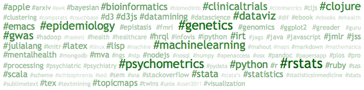
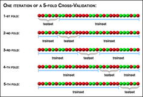

# Analyse de données textuelles

## Text mining [with R, @robinson-2017-text-minin]

)](../assets/img_tidytmbook.jpg)


## Flux de données Twitter

140 (x2 depuis Nov. 2017) caractères + hash tags

Les données Twitter (plus généralement les médias sociaux) peuvent être utilisées dans un cadre de [recherche exploratoire][drob] ou dans un contexte médical [@dechoudhury-2013-predic-depres, @mcmanus-2015-minin-twitt]. Ces données servent généralement de point d'entrée à un modèle prédictif, mais il est également possible de prendre en compte la [dimension temporelle][rocketscience]. L'[analyse de sentiments][sentiment] ({positif, négatif, neutre}, {joy, sadness, fear, anger, ...}) est également largement répandue.

Packages R : `{twitteR}` avec [OAuth][oauth], `{streamR}`, `{syuzhet}`, `{sentiment}` (depr.), `{sentimentr}`, `{qdap}`, `{quanteda}`, …  
Tutoriels : <https://sites.google.com/site/miningtwitter/references>.

[oauth]: http://thinktostart.com/twitter-authentification-with-r/
[drob]: http://varianceexplained.org/r/trump-tweets/
[rocketscience]: https://justrocketscience.com/post/pewdiepie-sentiment
[sentiment]: https://www.csc.ncsu.edu/faculty/healey/tweet_viz/tweet_app/

## Illustration

```r
library(twitteR)  ## cf. setup_twitter_oauth()
library(stringr)
tw = userTimeline("chlalanne", n = 1000)
find.tag = function(x) 
  unlist(str_extract_all(x$getText(), "#[A-Za-z0-9]*"))
tags = lapply(tw, function(x) try(find.tag(x), 
              silent = TRUE))
sort(table(unlist(tags)), decr = TRUE)
```

##  

```r
library(snippets)
wcl = table(unlist(tags))
names(wcl) = str_replace_all(names(wcl), "#", "")
cloud(wcl[wcl > 5])
```



Note : Le package `snippets` n'est plus disponible sur CRAN mais peut être installé depuis [RForge][rforge].

[Rforge]: http://rforge.net/snippets/


## Application

[Text Mining the Complete Works of William Shakespeare](http://www.exegetic.biz/blog/2013/09/text-mining-the-complete-works-of-william-shakespeare/)


# Analyse d'email


## Analyse d'emails

[Enron data set](https://www.cs.cmu.edu/~./enron/) (`enron.db`, SQLite)

```
% sqlite enron.db
sqlite> .tables
Employee      EmployeeWithVars  MessageBase RecipientBase
EmployeeBase  Message           Recipient
sqlite> .schema Message
CREATE VIEW Message AS
SELECT
    mid,
    filename,
    datetime(unix_time, 'unixepoch') AS time,
    unix_time,
    subject,
    from_eid
FROM
    MessageBase;
```

##  

```
sqlite> select * from Message limit 5;
1|taylor-m/sent/11|1998-11-13 04:07:00|910930020| …
2|taylor-m/sent/17|1998-11-19 07:19:00|911459940| …
3|taylor-m/sent/18|1998-11-19 08:24:00|911463840| …
```

Importation de la base de données sous R : 

```r
library(dplyr)
con = src_sqlite("enron.db")
d = tbl(con, "Message")
head(d, 3)
```

Tutoriel dplyr/SQL : [MySQL and R Webinar][dbidplyr].

[dbidplyr]: https://beanumber.github.io/mysql-r-webinar/index.html


## "Lazy" operation

```r
y = mutate(d, year = substr(time, 1, 4))
## collect(y)
head(y, 3)
```

Dans la mesure du possible, `dplyr` "traduit" le code R en code SQL.

```r
> show_query(select(y, year))
<SQL>
SELECT `year` AS `year`
FROM (SELECT `mid`, `filename`, `time`, `unix_time`, 
  `subject`, `from_eid`, substr(`time`, 1, 4) AS `year`
FROM `Message`)
```

```r
> summary(as.numeric(collect(select(y, year))[[1]]))
   Min. 1st Qu.  Median    Mean 3rd Qu.    Max.
   1998    2001    2001    2001    2001    2002
```


# Détection de spam


## Un problème supervisé

`ElemStatLearn::spam`

- 4601 mail classés en spam ou non
- fréquence relative de 57 mots-clés (pour chaque classe)
- `spam_names.txt`

        if (george < 0.6) and (you > 1.5) then spam
        else email


##  

 documentation](../assets/img_classifier.png)


## Classifier naïf bayésien

$$\underset{c}{\text{argmax}}\;p(C=c)\prod_{i=1}^np(F_i=f_i\mid C=c)$$

```r
data(spam, package = "ElemStatLearn")
library(klaR)

# set up a training sample
train.ind = sample(1:nrow(spam), ceiling(nrow(spam)*2/3))

# apply NB classifier
nb.res = NaiveBayes(spam ~ ., data = spam[train.ind,])
```

## Rappels sur la validation croisée




## Résultats

```r
> # predict on holdout units
> nb.pred = predict(nb.res, spam[-train.ind,])

> # raw accuracy
> confusion.mat = table(nb.pred$class, 
                        spam[-train.ind,"spam"])
> confusion.mat

        email spam
  email   519   34
  spam    420  560
> sum(diag(confusion.mat))/sum(confusion.mat)
[1] 0.7038487
```


## References

